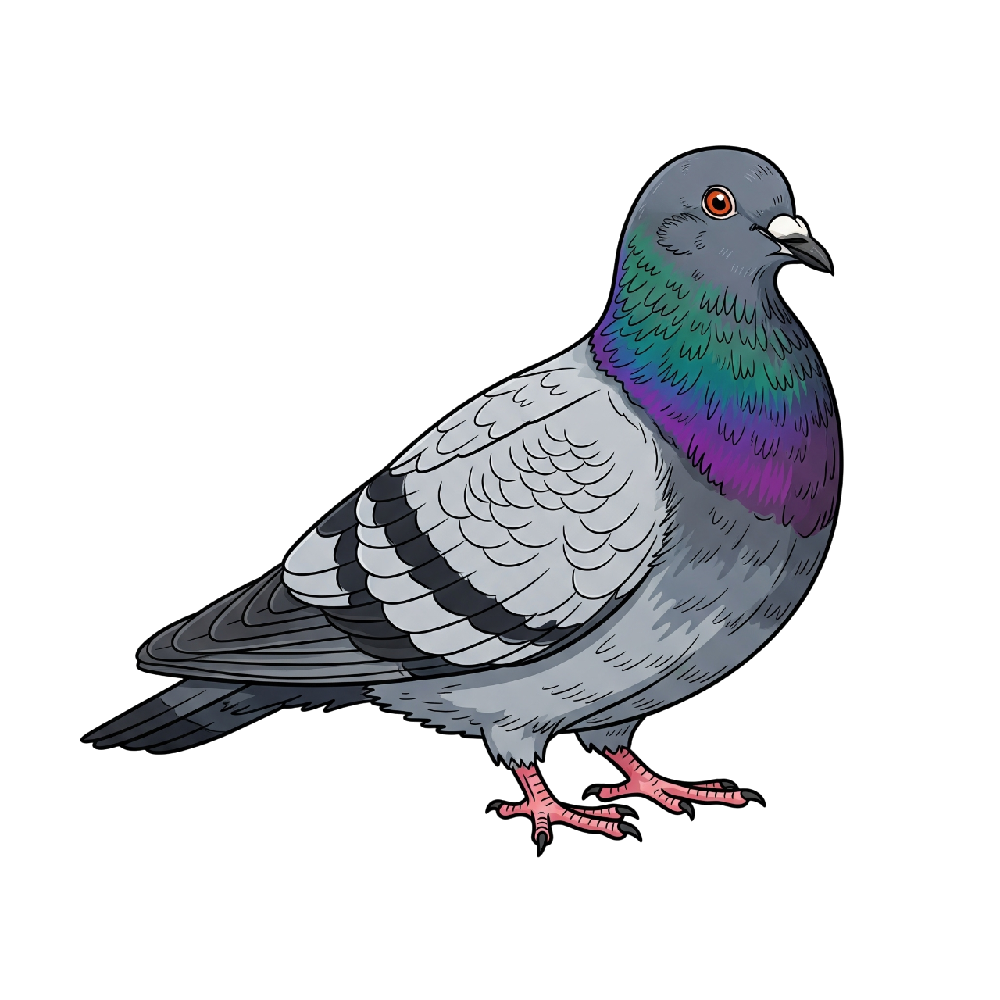
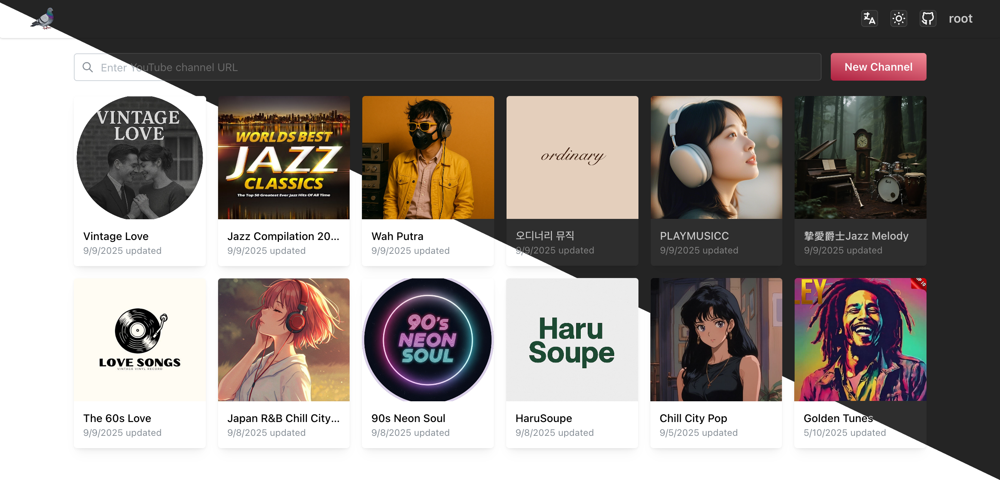

<div align="center">
  
  <h1>PigeonPod</h1>
  <p>用最简单优雅的方式，将你喜爱的 YouTube 频道转换为播客频道。</p>
</div>

[](README.md)

## Screenshots

### Channel list


### Channel detail


## 核心功能

- **🎯 智能频道订阅**: 通过 YouTube 频道 URL 快速添加频道
- **📱 自动同步更新**: 定时检查并同步频道最新内容，支持增量更新
- **🎵 音频下载转换**: 自动将 YouTube 视频转换为 MP3 音频文件
- **📻 RSS 播客订阅**: 生成标准 RSS 订阅链接，支持任何播客客户端
- **🔍 内容过滤**: 支持关键词（包含/排除）和节目时长过滤
- **🌐 多语言支持**: 完整支持中文和英文界面
- **📊 节目管理**: 查看、删除、重试下载失败的节目

## 技术栈

### 后端
- **Java 17** - 核心语言
- **Spring Boot 3.5** - 应用框架
- **SQLite** - 轻量级数据库
- **Sa-Token** - 权限认证框架
- **YouTube Data API v3** - YouTube 数据获取
- **yt-dlp** - 视频下载工具
- **Rome** - RSS 生成库

### 前端
- **React 19** - 用户界面框架
- **Vite 7** - 构建工具
- **Mantine 8** - UI 组件库
- **React Router 7** - 路由管理
- **i18next** - 国际化支持
- **Axios** - HTTP 客户端

## 部署方式

### 使用 Docker Compose（推荐）

1. 使用 docker-compose 配置文件，注意根据自己的需求修改环境变量
```yml
version: '3.9'
services:
  pigeon-pod:
    image: 'ghcr.io/aizhimou/pigeon-pod:main'
    container_name: pigeon-pod
    ports:
      - '8834:8080'
    environment:
      - 'PIGEON_BASE_URL=https://xxxx.xxx' # set to your domain
      - 'PIGEON_AUDIO_FILE_PATH=/data/audio/' # set to your audio file path
      - 'SPRING_DATASOURCE_URL=jdbc:sqlite:/data/pigeon-pod.db' # set to your database path
    volumes:
      - data:/data

volumes:
  data:
```

2. 启动服务
```bash
docker-compose up -d
```

4. 访问应用
打开浏览器访问 `http://{localhost}:8834`

## 开发指南

### 环境要求
- Java 17+
- Node.js 22+
- Maven 3.9+
- SQLite
- yt-dlp

### 本地开发

1. 克隆项目
```bash
git clone https://github.com/aizhimou/PigeonPod.git
cd PigeonPod
```

2. 配置数据库
```bash
# 创建数据目录
mkdir -p data/audio

# 数据库文件会在首次启动时自动创建
```

3. 配置 YouTube API
   - 在 [Google Cloud Console](https://console.cloud.google.com/) 创建项目
   - 启用 YouTube Data API v3
   - 创建 API 密钥
   - 在用户设置中配置 API 密钥

4. 启动后端
```bash
cd backend
mvn spring-boot:run
```

5. 启动前端（新终端）
```bash
cd frontend
npm install
npm run dev
```

6. 访问应用
- 前端开发服务器: `http://localhost:5173`
- 后端 API: `http://localhost:8080`

### 项目结构
```
pigeon-pod/
├── backend/                 # Spring Boot 后端
│   ├── src/main/java/      # Java 源代码
│   │   └── top/asimov/pigeon/
│   │       ├── controller/ # REST API 控制器
│   │       ├── service/    # 业务逻辑服务
│   │       ├── mapper/     # 数据访问层
│   │       ├── model/      # 数据模型
│   │       ├── scheduler/  # 定时任务
│   │       └── worker/     # 异步工作器
│   └── src/main/resources/ # 配置文件
├── frontend/               # React 前端
│   ├── src/
│   │   ├── components/     # 可复用组件
│   │   ├── pages/         # 页面组件
│   │   ├── context/       # React Context
│   │   └── helpers/       # 工具函数
│   └── public/            # 静态资源
├── data/                  # 数据存储目录
│   ├── audio/            # 音频文件
│   └── pigeon-pod.db     # SQLite 数据库
├── docker-compose.yml    # Docker 编排配置
└── Dockerfile           # Docker 镜像构建
```

### 开发注意事项
1. 确保 yt-dlp 已安装并可在命令行中使用
2. 配置正确的 YouTube API 密钥
3. 确保音频存储目录有足够的磁盘空间
4. 定期清理旧的音频文件以节省空间