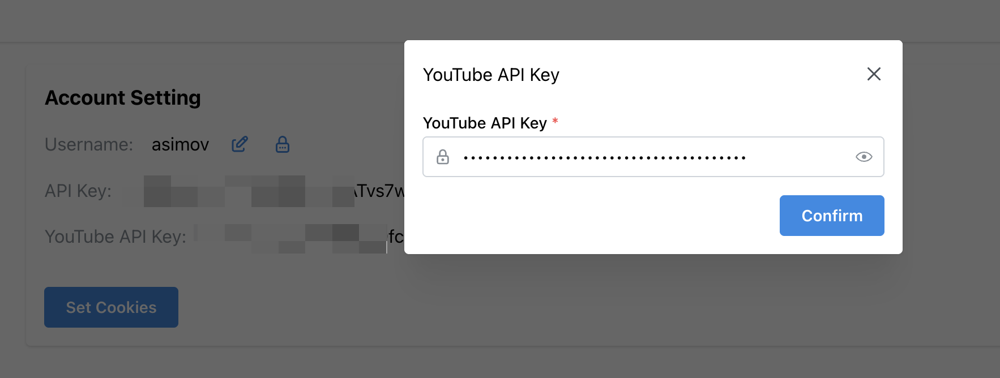

# 如何获取 YouTube Data API 密钥

1. 导航到 https://console.developers.google.com

2. 点击 `Select a project`.

3. 点击 `New project`.

4. 填写一个名称并点击 `Create` button.

5. 点击 `Library`, 找到并点击 `YouTube Data API v3` 这个 API.

6. 点击 `Enable`.

5. 点击 `Credentials`.

6. 点击 `Create credentials`.

7. 选择 `API key`.

8. 复制 `API key`.

9. 在 PigeonPod 中配置 `API key`.

